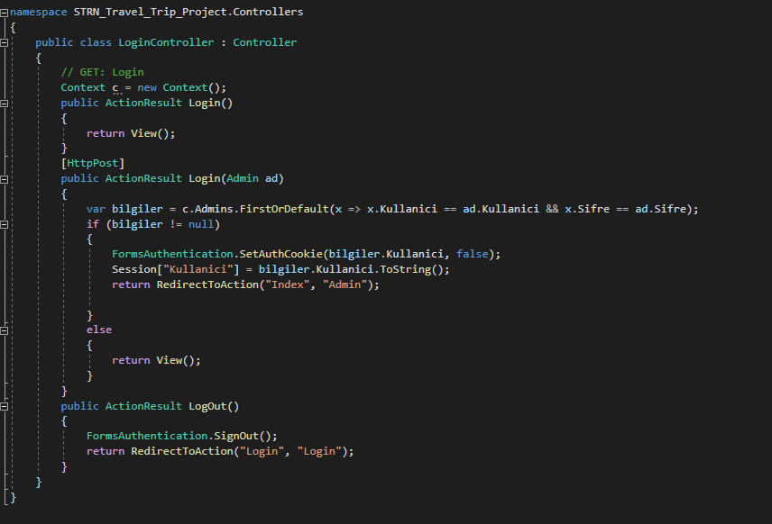

# Saturn Holiday & Travel Site

This project was developed with Asp.Net Mvc5. You can read and comment on blog posts about the cities you want to visit. There is also an admin-specific panel. There is an area where you can delete blogs, update them, or even add new blogs. In addition, it has the right to delete comments.

I developed this project to better consolidate and learn Asp.net MVC5.

## Frameworks Used
* .NET Framework (4.6.1)
* Entity Framework (6.0.0)

## Project Setup

First you need to [install](https://visualstudio.microsoft.com/tr/) Visual Studio.

You must select the ASP.NET Web Application (.NET Framework) option and select the version. Ins. I developed the project with version 4.6.1.

After choosing your project name and version, a screen comes up where you can choose how to develop the application in the next step. Since we will use MVC, we choose the MVC option.

Check MySQL as datastore. I created my classes in Model. I submitted this to the database.

---

## What is included in the project?

* First of all, I used partial view in some areas to avoid a dirty image when there will be changes on my homepage.

* I used a slider for the images of the last places visited so that the images used in each blog change in order


---

* Taken according to the last 3 blog dates entered on my home page. Thus, as each new blog is added, it comes to the first place.


---

* This is how I listed my most popular and most commented blogs.


---

* Here, too, I have ranked blogs as the best places.


---

* I made a special page for blogs. Here, I listed all the blogs and clicked the read more button, allowing them to reach more detailed content.


* The comment field is also as follows.


* In my admin panel, there are areas to add, delete, update and see the details of blogs.


* I have created a page where I can see the comments, control them and delete them when bad comments are received.


### Admin Controller

* I created this controller to create, edit or delete comments and blogs.

 

### Blog Controller

* I created a controller to list all my blogs and see their details. I also wrote the codes for the comment area in this controller.


* I used a lot of partial views on the homepage. Thanks to these partials, I got the ease of part and manage.

``` 
 public PartialViewResult Partial1()
        {

            var degerler = c.Blogs.OrderByDescending(x => x.Id).Take(2).ToList();
            return PartialView(degerler);
        }

```

```
@using STRN_Travel_Trip_Project.Models.Siniflar
@model List<Blog>
<div class="con-bot">

    @foreach (var x in Model)
    {
        <div class="left">
            <div class="bot-left">
                
            </div>
            <div class="left-text">
                <h4>@x.Baslik</h4>
                <span class="doller">@x.Tarih.ToString("dd.MM.yyyy")</span>
                <p>@x.Aciklama.Substring(0, 80)</p>
                <p><a href="~/Blog/BlogDetail/@x.Id"><span class="read">Read More</span></a></p>
            </div>
        </div>
    }

    @Html.Action("Partial2", "Default")
    <div class="clear"></div>

</div>
```

In this way, when I want to make changes on the main page, I got rid of that code mess.

### Login Controller
* Since this controller is only for admin, I created a field where I can directly set my username and password via sql and log in that way. I don't have a login or registration page for members.

 
