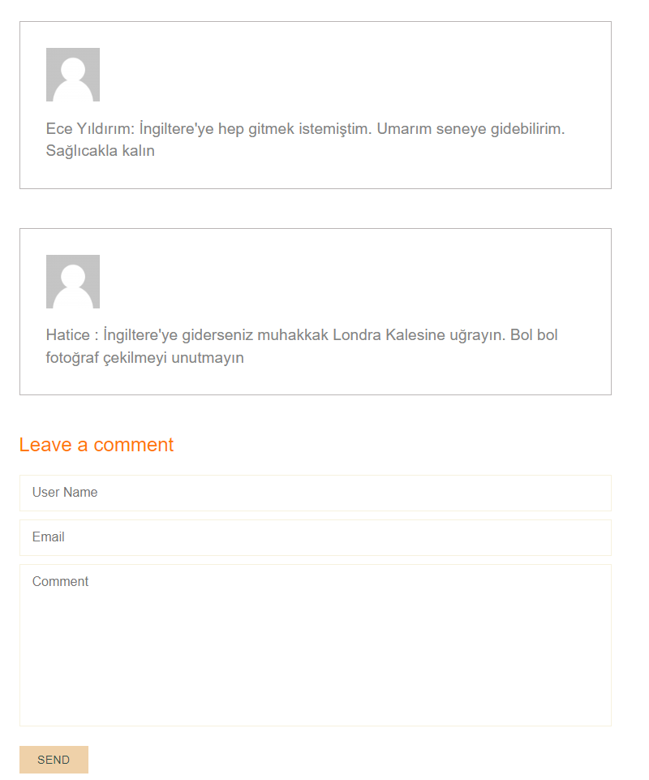

# Saturn Holiday & Travel Site

Bu proje Asp.Net Mvc5 ile geliştirilmiştir. Gitmek istediğiniz şehirlerle ilgili blog yazılarını okuyabilir, yorum yapabilirsiniz. Ayrıca admine özel bir panel de bulunmaktadır. Buradan blogları silebilir, güncelleyebilir, hatta yeni blog ekleyebileceği bir alan bulunmaktadır. Buna ek olrak yorumları da silme yetkisi bulunmaktadır. 

Bu projeyi Asp.net MVC5'i daha iyi pekiştirmek ve öğrenmek için geliştirdim. 

## Frameworks Used
* .NET Framework (4.6.1)
* Entity Framework (6.0.0)

## Project Setup

First you need to [install](https://visualstudio.microsoft.com/tr/) Visual Studio.

You must select the ASP.NET Web Application (.NET Framework) option and select the version. Ins. I developed the project with version 4.6.1.

After choosing your project name and version, a screen comes up where you can choose how to develop the application in the next step. Since we will use MVC, we choose the MVC option.

Check MySQL as datastore. I created my classes in Model. I submitted this to the database.

---

## What is included in the project?

* İlk olarak anasayfamda değişiklikler olacağı zaman kirli bir görüntü oluşmaması için bazı alanlarda partial view kullandım.

* Gidilen son yerlerin görselleri için bir slider kullandım böylelikle her blogda kullanılan görseller sırayla değişmektedir

---

* Ana sayfamda girilen son 3 blog tarihine göre çekilmiştir. Böylelikle her yeni blog eklendikçe ilk sıraya gelmektedir.

---

* Popüler olan en çok yorum yapılan bloglarımı da bu şekilde sıraladım.

---

* Burada da blogları en iyi yerler olarak sıraladım.

---

* Bloglara özel sayfa yaptım. Burada da tüm blogları listeleyip read more butonuna tıklayıp daha detaylı içeriği ulaşmalarını sağladım.

* Yorum alanı da aşağıdaki gibidir.

* Admin panelimde blogları ekleme,silme, güncelleme ve detaylarını görme alanları bulunmaktadır. 

* Yorumları da görebileceğim, denetleyebileceğim, kötü yorum geldiği zaman silebileceğim bir sayfa oluşturdum.

